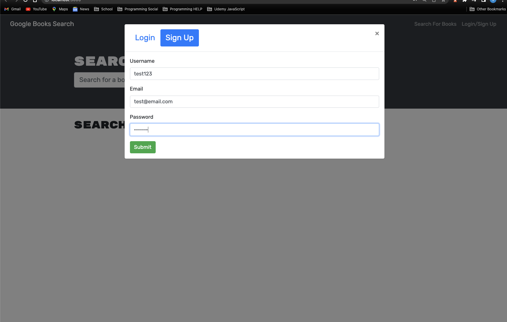

# BookSearch

### Heroku not working. Having heroku verifying account problems.

### **GitHub Repository:**

https://github.com/Jimmy-Vela06/Text-Editor

### **Link to Video**

https://drive.google.com/file/d/1bUy1_DnSbRzAAdyAr8r0dp_oRo0Yo6gJ/view

## []

## **Table of Contents:**

### [Description](#description)

### [DevDependencies](#devdependencies)

### [Installation](#installation)

### [Usage](#usage)

### [Image](#image)

### [License](#license)

### [Questions](#questions)

## **Description:**

###AS AN avid reader
###I WANT to search for new books to read
###SO THAT I can keep a list of books to purchase

###This application uses MERN with Apollo server and graphQl. Users are able to search for books using the google API and save it to their personal book list. User is also able to update their list through the use of the delete button.

## **DevDependencies:**

- "bootstrap": "^4.4.1",
- "jwt-decode": "^2.2.0",
- "react": "^16.13.1",
- "react-bootstrap": "^1.0.1",
- "react-dom": "^16.13.1",
- "react-router-dom": "^6.2.1",
- "react-scripts": "3.4.1"

## **Installation:**

npm install

## **Usage:**

To run the application , type in your terminal : npm run devlop .

## **Image:**

## **License:**

### MIT License

Copyright (c) 2023 Jimmy Vela Jr.

Permission is hereby granted, free of charge, to any person obtaining a copy
of this software and associated documentation files (the "Software"), to deal
in the Software without restriction, including without limitation the rights
to use, copy, modify, merge, publish, distribute, sublicense, and/or sell
copies of the Software, and to permit persons to whom the Software is
furnished to do so, subject to the following conditions:

The above copyright notice and this permission notice shall be included in all
copies or substantial portions of the Software.
